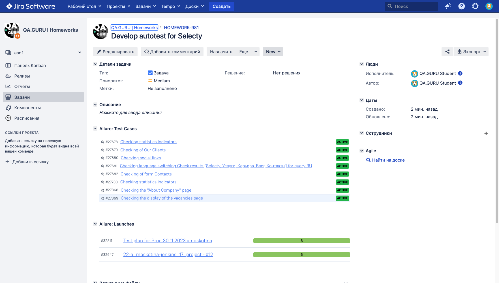
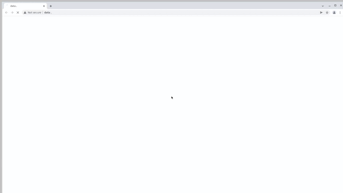

## Демопроект по автоматизации тестовых сценариев для сайта компании Selecty

>**Selecty** — лидер рынка ИТ рекрутинга и аутсорсинга.

## :feather: Содержание:

- [Используемый стек](#используемый-стек)
- [Реализованные проверки](#реализованные-проверки)
- [Запуск автотестов](#запуск-автотестов)
- [Сборка в Jenkins](#сборка-в-jenkins)
- [Пример Allure-отчета](#пример-Allure-отчета)
- [Интеграция с Allure TestOps](#интеграция-с-Allure-TestOps)
- [Интеграция с Jira](#интеграция-с-Jira)
- [Уведомления в Telegram](#уведомления-в-Telegram-с-использованием-бота)
- [Видео примера запуска тестов в Selenoid](#видео-примера-запуска-тестов-в-Selenoid)

## Используемый стек:
<p align="center">
<a href="https://www.jetbrains.com/ru-ru/idea/"></a>
<a href="https://www.java.com/"></a>
<a href="https://junit.org/junit5/docs/current/user-guide/"></a>
<a href="https://selenide.org/"></a>
<a href="https://gradle.org/"></a>
<a href="https://allurereport.org/"></a>
<a href="https://aerokube.com/selenoid/latest/"></a>
<a href="https://www.jenkins.io/"></a>
<a href="https://web.telegram.org/"></a>
<a href="https://github.com/"></a>
<a href="https://qameta.io/"></a>
<a href="https://www.atlassian.com/ru/software/jira"></a>
</p>

- Тесты написаны на языке `Java`
- Используется фреймворк для автоматизированного тестирования `Selenide` и `JUnit 5`
- Проект собирается в `Gradle`
- Для запуска браузеров используется `Selenoid`
- Запуск автотестов осуществляется с помощью джобы настроенной в `Jenkins`
- После прохождения тестов формируется `Allure-отчет`
- Результаты приходят в `Telegram`
- Так же есть интеграция с `Allure TestOps` и `Jira`

## Реализованные проверки:
- Параметризованный тест смены языка на русский, английский
- На главной странице отображаются иконки социальных сетей
- Отображение статистических показателей
- Отображение табов с группированием клиентов
- Заполнение формы для связи с контактами

## Запуск автотестов:
### Запуск тестов из терминала:
```
gradle clean demo
```
При выполнении данной команды в терминале IDE тесты запустятся удаленно в `Selenoid`

### Запуск тестов в Jenkins:

Для запуска сборки необходимо перейти в раздел `Build with Parameters` и нажать кнопку `Build`
<p align="center">

</p>

### Параметры сборки:

- `REMOTE_DRIVER_URL` – адрес удаленного сервера, на котором будут запускаться тесты
- `BROWSER` – браузер, в котором будут выполняться тесты (по умолчанию - chrome)
- `BROWSER_VERSION` – версия браузера, в которой будут выполняться тесты (по умолчанию - 100.0)
- `BROWSER_SIZE` – размер окна браузера, в котором будут выполняться тесты (по умолчанию - 1920x1080)


После выполнения сборки и прогона тестов, в блоке `Build History` напротив номера сборки появятся значки `Allure Report` и `Allure TestOps`, при клике на которые откроется страница с сформированным html-отчетом и тестовой документацией соответственно.

## Пример Allure-отчета:

<p align="center">

</p>


## Интеграция с Allure TestOps:

На Dashboard в `Allure TestOps` отображается статистика с количеством ручных и автоматизированных тестов. Новые тесты, а так же результаты прогона появляются при каждом запуске сборки

<p align="center">

</p>


### Результат выполнения автотеста:
<p align="center">

</p>


## Интеграция с Jira:

Реализована интеграция `Allure TestOps` с `Jira`, в тикете отображается, какие тест-кейсы были написаны в рамках задачи и результат их прогона.

<p align="center">

</p>


## Уведомления в Telegram с использованием бота

После завершения прогона автотестов автоматически отправляется отчет с результами прогона тестов в `Telegram`

<p align="center">

</p>


## Видео примера запуска тестов в Selenoid:

В отчетах Allure для каждого теста прикреплен не только скриншот, но и видео прохождения теста
<p align="center">
  
</p>